# Trust Anchors

This repository contains public keys (and related certificates) which
comprise the realm's trust anchors.

The corresponding private keys are generated and stored on hardware
security devices.

```mermaid
graph TD;
  root_a1(Root CA A1) --> inter_x1(Intermediate<br/>CA X1);
  root_b1(Root CA B1) --> inter_x1;
  inter_x1 --> prov_ca[Provisioning CA];
  inter_x1 --> infra_ca[Infrastructure<br/>Services CA];
  inter_x1 --> roles_ca[Roles CA];
  inter_x1 --> user_ca[Users CA];
  prov_ca --> token_ra[Token<br/>Provisioning RA];
  prov_ca --> device_ra[Device<br/>Provisioning RA];
  prov_ca --> container_ra[On-site Container<br/>Provisioning RA];
  prov_ca --> gcp_ra[GCP RA];
  prov_ca --> aws_ra[AWS RA];

  style root_a1 fill:#222,stroke:#822;
  style root_b1 fill:#222,stroke:#822;
  style inter_x1 fill:#222,stroke:#882;

  style prov_ca stroke:#282;
  style infra_ca stroke:#282;
  style roles_ca stroke:#282;
  style user_ca stroke:#282;

  style gcp_ra stroke-dasharray:1 1;
  style aws_ra stroke-dasharray:1 1;
```

Certificates within a realm are routinely issued to:

* People (ordinary user accounts)
* Service groups (e.g., Identity and access management) and Services (e.g., Directory Service) within an environment
* Individual service nodes (service accounts, e.g., NFS on server25)
* Roles
* Role instances (e.g., `joe/admin`)
* Network hosts (physical and virtual machines) and containers
* Point-to-Point VPN endpoints
