# Trust Anchors

This repository contains public keys (and related certificates) which
comprise the realm's trust anchors.

The corresponding private keys are generated and stored on hardware
security devices.

```mermaid
graph TD;
  root_a1(Root CA A1) --> inter_x1(Intermediate<br/>CA X1);
  root_b1(Root CA B1) --> inter_x1;
  inter_x1 --> prov_ca[Provisioning CA];
  inter_x1 --> infra_ca[Infrastructure<br/>Services CA];
  inter_x1 --> roles_ca[Roles CA];
  inter_x1 --> user_ca[Users CA];
  prov_ca --> token_ra[Token<br/>Provisioning RA];
  prov_ca --> device_ra[Device<br/>Provisioning RA];
  prov_ca --> container_ra[On-site Container<br/>Provisioning RA];
  prov_ca --> gcp_ra[GCP RA];
  prov_ca --> aws_ra[AWS RA];

  style root_a1 fill:#222,stroke:#822;
  style root_b1 fill:#222,stroke:#822;
  style inter_x1 fill:#222,stroke:#882;

  style prov_ca stroke:#282;
  style infra_ca stroke:#282;
  style roles_ca stroke:#282;
  style user_ca stroke:#282;

  style gcp_ra stroke-dasharray:1 1;
  style aws_ra stroke-dasharray:1 1;
```

Certificates within a realm are routinely issued to:

* People (ordinary user accounts)
* Service groups (e.g., Identity and access management) and Services (e.g., Directory Service) within an environment
* Individual service nodes (service accounts, e.g., NFS on server25)
* Roles
* Role instances (e.g., `joe/admin`)
* Network hosts (physical and virtual machines) and containers
* Point-to-Point VPN endpoints

## Offline CAs

The root and first-level intermediate keys are held on smartcards because
keeping a physical credit-card-sized device secure for long periods is
generally easier than keeping secret key material on disk secure for long
periods. Whilst one could store encrypted keys on USB sticks or memory
cards, this is essentially equivalent to storing the keys on a smartcard with
the "extractable" attribute set.

As there is no good reason to be able to extract the keys other than for
disaster-recovery purposes, and that can be accomplished by other means,
this network takes the "low-cost hardware designed specifically for the task"
route.

As the keys are not extractable, we operate two root certificate authorities,
which function almost identically to one another, but either can be used to
seamlessly introduce a replacement for the other should its keys become
inaccessible  

### Root A1 and B1

Each of the two root keys is generated and stored (non-extractably) on an
Aventra MyEID smartcard, which is only inserted into a card reader when
performing CA operations. The two smartcards are stored in different
geographical locations.

Root A is an RSA key, and Root B is a Prime256v1 EC key.

In both cases, only one key has been generated, hence 'A1' and 'B1'. If either
is ever replaced (e.g., due to loss or damage of the smartcard), they will be
designated 'A2' or 'B2' as appropriate.

A1 has an initial validity period of 15 years (Nov 14 2037), B1 has an initial
validity period of 10 years (Nov 15 2032). It is highly likely that updated
certificates will be issued for both well before either of those dates.

A1 and B1 cross-sign one another (with roughly equivalent validity periods to
the self-signed certificates—to within an hour of one another), but in
practice this is unnecessary.

The primary purpose of Root A and Root B is to sign the Intermediate X certificate.

### Intermediate X1

Intermediate X is generated and stored (non-extractably) on an Aventra MyEID
smartcard.

In the event of its loss or damage, a new Intermediate X2 can be signed by
the existing A1 and B1 roots and brought (relatively) seamlessly into service.

## Online CAs

The online CAs are instances of [StepCA](https://smallstep.com/docs/step-ca) which are
manually bootstrapped and integrated into the PKI. Due to the way Step works,
the online CAs always identifiy themselves with a root fingerprint corresponding
to A1 or B1. Within the instance itself, `certs/root_ca.crt` is a copy of
the A1 or B1 certificate (it doesn't matter which, but it can only be one).

`certs/intermediate_ca.crt` contains the certificate generated when the
instance was bootstrapped via `step ca init`, but signed by Intermediate X1
rather than self-signed as it is initially, followed by copies of the
Intermediate X1 certificate signed by A1 and B1. All three of these
certificates are passed to clients of the CA as part of the "full chain"
when a new certificate is issued.

Step itself uses the CA certificate in `certs/intermediate_ca.crt` to issue
itself a leaf certificate ("CN=Step Online CA") containing its configured
IPs and DNS names in a `subjectAltName` extension, on the fly, which is
then used by the CA's HTTPS server.

### Provisioning CA

The Provisioning CA exists to issue a form of bearer token which can be
exchanged for a different kind of credential or bootstrap an authentication
process. For example, hosts configured to access the directory server
need to present a client certificate to do so, and the process of
authenticating a user may involve accessing the directory (depending upon
the client configuration), and so the certificate issued to it by the
Provisioning CA is used for this purpose.

Certificates issued by the Provisioning CA are tuned to ensure they cannot be
easily confused with ordinary client or server certificates by either humans
or applications, without unduly limiting their usefulness as a bearer.

Because every device and every container that interacts with network services
requires a certificate from the Provisioning CA, it's deployed alongside
multiple _Registration Authorities_, which are also instances of Step,
[operating in RA mode](https://smallstep.com/docs/step-ca/registration-authority-ra-mode/).

The specifics of this implementation are likely to be revised in the future.

### Infrastructure CA

The Infrastructure CA issues certificates to services which form part of the
realm's operational infrastructure. This is distinct from services which
simply happen to operate _on_ the operational infrastructure. For example,
the LDAP directory server and Kerberos KDC both have certificates issued
by the Infrastructure CA.

Even if clients don't trust any other part of the PKI, they _must_ trust
the Infrastructure CA in order to be able to access core network services.
